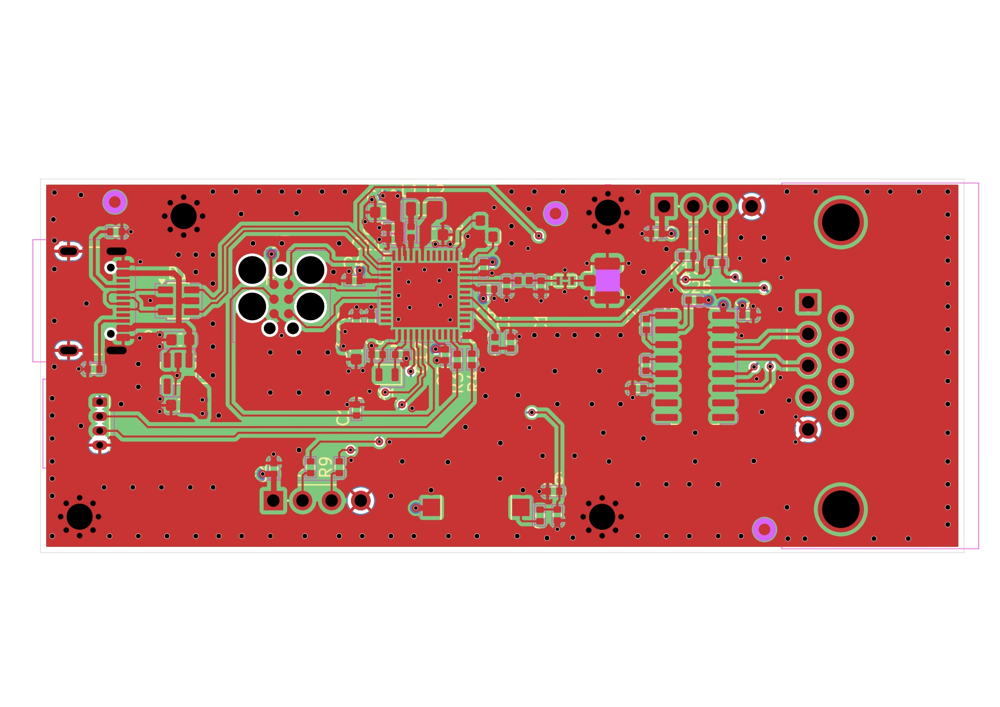
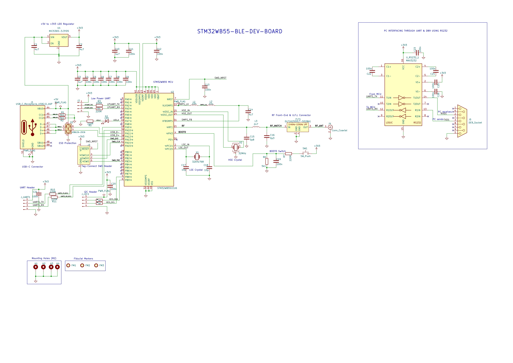

# stm32wb55-ble-dev-board

> A compact, 4-layer prototype Input/Output board built around the **STM32WB55CEU6** — a dual-core ARM wireless SoC with Bluetooth 5.0 and IEEE 802.15.4 support.

---

## 📌 Overview

The **stm32wb55-ble-dev-board** is a feature-rich embedded development platform designed for IoT, wireless sensing, and industrial control applications. It integrates a high-performance wireless microcontroller with USB-C connectivity, RS232 PC interfacing, RF front-end matching, and a comprehensive set of expansion headers — all on a compact, professional-grade 4-layer red PCB.

---

## 🖼️ Board Preview

| PCB Layout | Circuit Schematic |
|:---:|:---:|
|  |  |

> Place your board images in the `docs/` folder and update the paths above accordingly.

---

## ✨ Features

- **Dual-Core Wireless MCU** — STM32WB55CEU6 (ARM Cortex-M4 @ 64 MHz + ARM Cortex-M0+ radio core)
- **Bluetooth 5.0 / IEEE 802.15.4** — Zigbee, Thread, OpenThread ready
- **2.4 GHz RF Front-End** — Discrete LC matching network + U.F.L. coaxial antenna connector
- **USB-C Interface** — USB 2.0 Full Speed with ESD protection (USBLC6-2SC6)
- **RS232 PC Interface** — MAX3232 level converter + DB9 connector for legacy serial port compatibility
- **Clean Power Architecture** — MIC5365-3.3YD5 LDO (+5V → +3.3V) with distributed decoupling
- **SWD Debug Interface** — Tag-Connect header (SWDIO, SWDCLK, SWO, NRST)
- **DFU Bootloader** — BOOT0 push-button for USB firmware flashing
- **Expansion Headers** — UART, LPUART, I2C
- **Dual Crystal Oscillators** — 32 MHz HSE (RF) + 32.768 kHz LSE (RTC)
- **4-Layer Red PCB** — M3 mounting holes × 4, Fiducial markers × 3

---

## 🔧 Hardware Specifications

| Parameter | Specification |
|-----------|--------------|
| Microcontroller | STM32WB55CEU6 (Cortex-M4 @ 64 MHz + Cortex-M0+) |
| Flash / SRAM | 512 KB Flash / 256 KB SRAM |
| Wireless Protocol | Bluetooth 5.0, IEEE 802.15.4 (Zigbee, Thread) |
| RF Frequency | 2.400 – 2.500 GHz |
| RF Connector | U.F.L. Coaxial |
| Power Input | +5V via USB-C or external header |
| Operating Voltage | +3.3V (MIC5365-3.3YD5 LDO) |
| USB Interface | USB-C 2.0 Full Speed + ESD (USBLC6-2SC6) |
| Serial Interfaces | UART, LPUART, I2C, SWD, RS232 (MAX3232) |
| PC Serial Port | DB9 connector (RS232 ±12V) |
| Debug Interface | SWD Tag-Connect + NRST |
| HSE Crystal | 32 MHz |
| LSE Crystal | 32.768 kHz |
| Boot Mode | BOOT0 push-button switch |
| Mounting Holes | M3 × 4 (H1–H4) |
| Fiducial Markers | FM1, FM2, FM3 |
| PCB | Red, 4-Layer |
| Form Factor | ~80 mm × 35 mm |

---

## 📁 Repository Structure

```
stm32wb55-ble-dev-board/
├── Manufacturing/                          # Gerber files & fabrication outputs
├── Version1_IO_PCBFootprints.pretty/       # Custom KiCad footprint library
├── stm32wb55-ble-dev-board.kicad_pcb       # PCB layout file
├── stm32wb55-ble-dev-board.kicad_sch       # Schematic file
├── stm32wb55-ble-dev-board.kicad_pro       # KiCad project file
├── stm32wb55-ble-dev-board.kicad_prl       # PCB local settings
├── Version1_IO_SchematicSymbol.kicad_sym   # Custom schematic symbol library
├── 530480410.stp                           # 3D model (STEP)
├── DLF162500LT-5028A1--3DModel-STEP.step   # 3D model — RF filter
├── QFN127P600-8N.step                      # 3D model — QFN package
├── fp-lib-table                            # KiCad footprint library table
├── sym-lib-table                           # KiCad symbol library table
├── docs/
│   ├── pcb_layout.jpg                      # PCB layout image
│   └── schematic.jpg                       # Schematic image
└── README.md
```

---

## 🚀 Getting Started

### Prerequisites

- [STM32CubeIDE](https://www.st.com/en/development-tools/stm32cubeide.html) or [STM32CubeWB](https://www.st.com/en/embedded-software/stm32cubewb.html)
- [STM32CubeProgrammer](https://www.st.com/en/development-tools/stm32cubeprog.html) for flashing
- Tag-Connect TC2050 cable for SWD debug
- USB-C cable for power and USB DFU flashing

### Flashing via SWD

1. Connect a Tag-Connect TC2050 cable to the SWD header on the board.
2. Open STM32CubeIDE or STM32CubeProgrammer.
3. Select **STM32WB55CEU6** as the target device.
4. Flash your `.elf` or `.hex` firmware file.

### Flashing via USB DFU (Bootloader)

1. Hold the **BOOT0** button while powering the board via USB-C.
2. The MCU will enumerate as a DFU device on your PC.
3. Use STM32CubeProgrammer or `dfu-util` to flash:

```bash
dfu-util -a 0 -s 0x08000000:leave -D firmware.bin
```

### RS232 / PC Serial Interface

Connect a DB9 serial cable between the board and your PC (or use a USB-to-RS232 adapter). The MAX3232 handles level conversion automatically. Default UART settings:

```
Baud Rate : 115200
Data Bits : 8
Parity    : None
Stop Bits : 1
Flow Ctrl : None
```

---

## 📡 RF & Antenna

The RF front-end uses a discrete LC matching network and low-pass filter (DLC1625D-S0Z8A5) tuned for the 2.4–2.5 GHz band, feeding into a **U.F.L. coaxial connector**. Connect an external 2.4 GHz antenna (via U.F.L. or SMA adapter) before powering the RF subsystem.

> ⚠️ **Do not operate the RF transmitter without an antenna connected.** This may damage the RF front-end.

---

## 🔌 Pinout & Connectors

| Connector / Header | Signal(s) | Description |
|--------------------|-----------|-------------|
| USB-C (J1) | VBUS, D+, D−, CC1, CC2 | USB 2.0 Full Speed + Power |
| SWD Tag-Connect | SWDIO, SWDCLK, SWO, NRST, GND, 3V3 | Debug & Programming |
| UART Header | UART_TX, UART_RX, GND | General-purpose UART |
| LPUART Header | LPUART_TX, LPUART_RX, GND | Low-power UART |
| I2C Header | I2C_SCL, I2C_SDA, GND, 3V3 | I2C expansion |
| DB9 (J5) | RS232 TX, RX | PC serial port |
| RF (J1) | RF_ANT | U.F.L. coaxial antenna |
| BOOT0 (SW1) | BOOT0 | DFU bootloader trigger |

---


## 📐 PCB Stack-up

| Layer | Function |
|-------|----------|
| L1 (Top) | Signal + Components |
| L2 | Ground Plane |
| L3 | Power Plane (+3.3V) |
| L4 (Bottom) | Signal |

---

## 🤝 Contributing

Pull requests are welcome! For major changes, please open an issue first to discuss what you would like to change.

---

## 📬 Contact

For questions or collaboration, open an issue on this repository.

---

*Designed with STM32WB55CEU6 · 4-Layer PCB · Bluetooth 5.0 · IEEE 802.15.4*
